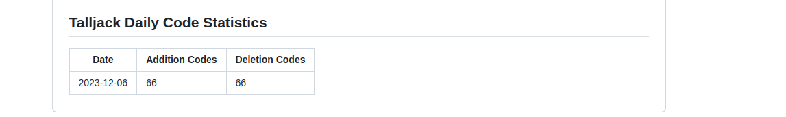

# Daily Codes Stats

A Nodejs script to count your daily codes, and it will auto-update daily code stats on your README.md.

You can use this action to your homepage repo, and it will update your README.md every day. Example: [Talljack](https://github.com/Talljack/Talljack/blob/main/.github/workflows/code-stats.yml)

## Usage

```yml
name: daily-code-stats
on:
  schedule:
    - cron: '0 0 * * *' # 每天运行一次
jobs:
  daily-code-stats:
    runs-on: ubuntu-latest
    steps:
      - name: Set up Node.js
        uses: actions/setup-node@v4
        with:
          node-version: '18'

      - name: Daily Codes Stats
        uses: Talljack/daily-code-stats@main

        env:
          token: ${{secrets.GITHUB_TOKEN}} # 使用存储在仓库 Secrets 中的 GitHub 令牌

      - name: Commit files
        id: commit-files
        run: |
          if [ -n "$(git status --porcelain README.md)" ]; then
            git config --local user.email "github-actions[bot]@users.noreply.github.com"
            git config --local user.name "github-actions[bot]"
            git add README.md
            git commit -m "Update README.md"
            echo "hasChange=true" >> $GITHUB_OUTPUT
          else
            echo "No Changes"
          fi

      - name: Push changes
        uses: ad-m/github-push-action@master
        if: ${{ steps.commit-files.outputs.hasChange == 'true' }}
        with:
          github_token: ${{ secrets.GITHUB_TOKEN }}
          branch: ${{ github.ref }}
```

Usually, you can add this action to your homepage repo, and it will update your README.md every day.



## Inputs

- `token` - Your `GITHUB_TOKEN`. This is required. Why do we need a `token`? Read more here: [About the GITHUB_TOKEN secret](https://help.github.com/en/actions/automating-your-workflow-with-github-actions/authenticating-with-the-github_token#about-the-github_token-secret). Default: `${{ github.token }}`

## Outputs

- `dailyCodeInfo` - The daily code info. JSON string. Example: `{"username": "Talljack", "2023-12-06": {"additions": 66, "deletions": 66}}`

## License

Licensed under the [MIT License](LICENSE).

<!-- START_STATS -->

## Talljack Daily Code Statistics

| Date       | Addition Codes | Deletion Codes |
|------------|-----------|-----------|
| 2025-05-13 | 0 | 0 |

<!-- END_STATS -->
